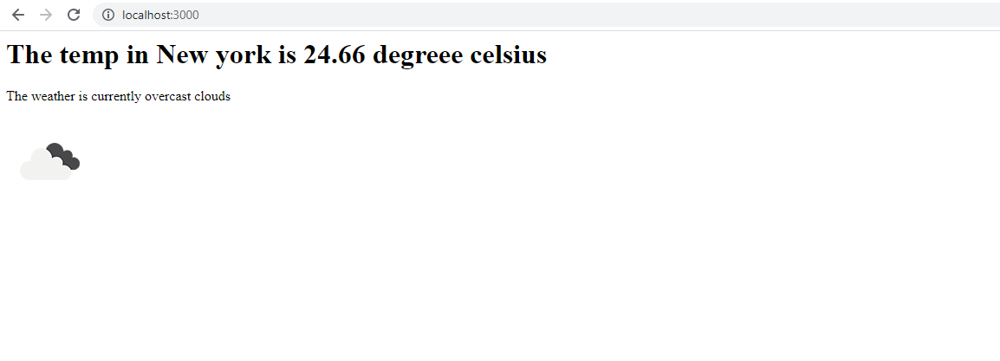

# Weather-app
This is a web application that can be used to see the weather of any city, country etc. It uses the [Open weather map](https://openweathermap.org/api) API to access and fetch data of weather at a place using NodeJS with ExpressJS as framework. 
To set up the project :-
* Download the project folder and cd into it.
* Create a file with name `.env`
* You will need to set your own API key by signing up on [Open weather map](https://openweathermap.org/api). Once key is generated, add it in your `.env` file in front of API_KEY.
I have added a **.env_sample** file to show how to configure a .env file. But, you should add it in your **.env** file only.
* Open your terminal in your project folder and enter the following commands
```
 npm install
 node weather.js
```
* Open `localhost:3000` in your browser.

You should see something like this if your have set up correctly.


